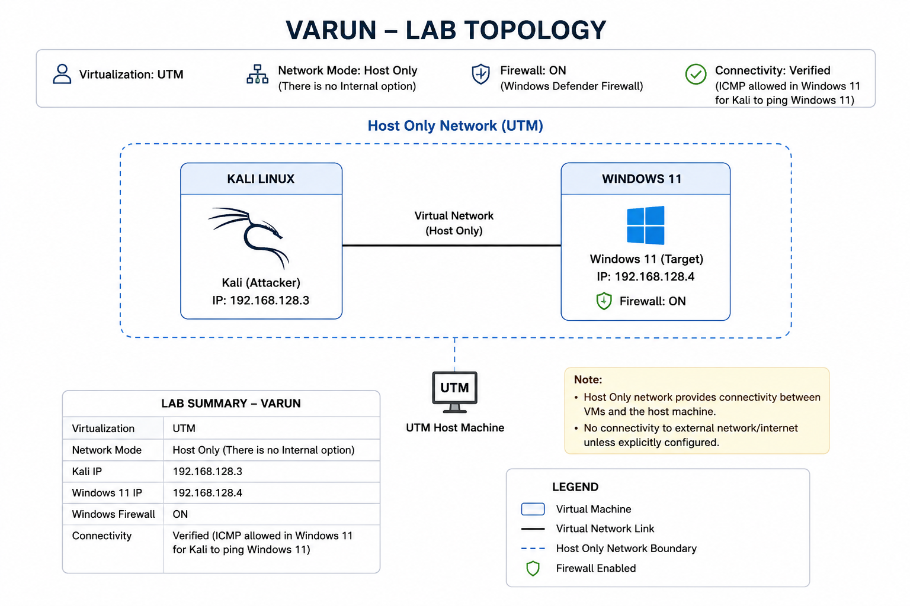

# 🔎 Nmap & Wireshark Network Analysis


## 🎯 Project Overview

This project is a hands-on network analysis lab using **Nmap** and **Wireshark**.

The purpose is to understand how network discovery and scanning work, then compare the results of Nmap with the actual network traffic captured in Wireshark.

The project focuses on:

* Network discovery
* Port scanning
* Service detection
* Packet capture
* Traffic analysis
* Comparing tool output with packet-level evidence
* Technical documentation

The work was completed in an isolated virtual lab environment.

---

## 🖥️ Lab Environment

| Component                     | Details                  |
| ----------------------------- | ------------------------ |
| 🐧 Attacker / Analysis System | Kali Linux               |
| 🪟 Target System              | Windows 11               |
| 💻 Virtualization             | UTM                      |
| 🌐 Network                    | Isolated virtual network |
| 🔍 Scanning Tool              | Nmap                     |
| 📡 Packet Analysis            | Wireshark                |

### 🌐 Network Configuration

The lab uses a direct virtual network between Kali Linux and Windows 11.

The current lab addressing is:

| System        | IP Address       |Role       |
| ------------- | ---------------- |---------------- |
| 🐧 Kali Linux | `192.168.128.3` |Analysis/ Scanning| 
| 🪟 Windows 11 | `192.168.128.4` |Target |

The environment is intended only for controlled testing between the two lab systems.

---

## 🏗️ Baseline & Network Topology

Before running the experiments, the network configuration and connectivity between Kali Linux and Windows 11 were verified.

Baseline evidence includes:

1. UTM network configuration
2. Kali Linux network configuration and connectivity
3. Windows 11 network configuration and connectivity
4. Windows 11 listening ports
5. Final lab network topology

📁 [**Baseline evidence**](https://github.com/varunmnair95/nmap-wireshark-network-analysis/tree/main/baseline-and-topology)

### 🗺️ Lab Topology



---

# 🔬 Experiments

The project is divided into three progressive experiments.

## [01 — Basic Host Discovery](https://github.com/varunmnair95/nmap-wireshark-network-analysis/tree/main/experiments/01-basic-host-discovery)

The first experiment focuses on identifying an active host on the lab network.

### Objective

* Discover the Windows 11 target using Nmap
* Confirm that the target is active
* Observe the traffic generated during discovery
* Correlate the Nmap result with packet-level evidence

The experiment used:

```bash
nmap -sn 192.168.128.4
```

The Wireshark capture showed an **ARP request and ARP reply** between the two systems, with the MAC address observed in the ARP response matching the MAC address reported by Nmap.

This demonstrates an important distinction:

* **ARP** is used for local IP-to-MAC address resolution on the local network.
* **ICMP** is another mechanism that can be used for host discovery, but it is not the only mechanism Nmap can use.

---

## [02 — Port Scanning](https://github.com/varunmnair95/nmap-wireshark-network-analysis/tree/main/experiments/02-port-scanning)

The second experiment examines TCP ports exposed by the Windows 11 target.

### Objective

* Identify open TCP ports
* Understand TCP port scanning
* Observe Nmap's TCP probes
* Correlate Nmap results with Wireshark traffic

The default scan used:

```bash
nmap 192.168.128.4
```

The observed open ports were:

| Port      | State | Service      |
| --------- | ----- | ------------ |
| `135/tcp` | open  | msrpc        |
| `139/tcp` | open  | netbios-ssn  |
| `445/tcp` | open  | microsoft-ds |

Wireshark showed TCP SYN probes from Kali to the Windows target and provided packet-level evidence supporting the Nmap results.

---

## [03 — Service & Version Detection](https://github.com/varunmnair95/nmap-wireshark-network-analysis/tree/main/experiments/03-service-detection)

The third experiment builds on port scanning by examining the services associated with the discovered ports.

### Objective

* Identify services running on open TCP ports
* Use Nmap service and version detection
* Observe the additional traffic generated by service detection
* Compare Nmap results with Wireshark captures

The scan used:

```bash
nmap -sV -p 135,139,445 192.168.128.4
```

Nmap identified:

| Port      | Service      | Result                                        |
| --------- | ------------ | --------------------------------------------- |
| `135/tcp` | msrpc        | Microsoft Windows RPC                         |
| `139/tcp` | netbios-ssn  | Microsoft Windows netbios-ssn                 |
| `445/tcp` | microsoft-ds | Service identified without a specific version |

Wireshark showed TCP communication to the investigated ports, including additional probes generated during service detection.

---

# 📡 Nmap + Wireshark Analysis

A key part of this project is comparing two views of the same network activity:

```text
Nmap
  ↓
Scan / Discovery
  ↓
Network Traffic
  ↓
Wireshark Capture
  ↓
Packet Analysis
  ↓
Compare Results
```

Nmap provides the scan results.

Wireshark provides packet-level visibility into the traffic generated during the scan.

Using both tools makes it possible to move beyond the final scan output and examine what actually happened on the network.

---

# 🤝 Collaboration

The project was completed using individual lab environments.

The three participants are:

* 👨‍💻 Hari Krishnan R K
* 👨‍💻 Manu P Nair
* 👨‍💻 Varun M Nair

Each participant maintains a separate repository and lab setup.

Collaboration included:

* Sharing approaches
* Discussing observations
* Comparing results
* Reviewing documentation

The implementation and evidence in this repository represent **my own lab work**.

### Participant Repositories

* [Hari Krishnan R K — Nmap & Wireshark Network Analysis](https://github.com/harikrishnan-rk/nmap-wireshark-network-analysis)
* [Manu P Nair — Nmap & Wireshark Network Analysis](https://github.com/manunair16/nmap-wireshark-network-analysis)
* [Varun M Nair — Nmap & Wireshark Network Analysis](https://github.com/varunmnair95/nmap-wireshark-network-analysis)

---

# 📸 Evidence

Evidence was collected throughout the baseline and experiments.

It includes:

* Network configuration
* Connectivity verification
* Target listening ports
* Nmap scan results
* Wireshark captures
* `.pcapng` files
* Experiment observations

The intention is to document the actual work performed rather than only describe the theory.

---

# 📂 Repository Structure

```text
nmap-wireshark-network-analysis/
│
├── README.md
│
├── baseline-and-topology/
│   ├── 01-utm-network-configuration-for-kali-and-win11.png
│   ├── 02-kali-network-configuration-and-connectivity.png
│   ├── 03-win11-network-configuration-and-connectivity.png
│   ├── 04-listening-ports-win11.png
│   └── 05-varun-lab-topology.png
│
├── experiments/
│   ├── 01-basic-host-discovery/
│   ├── 02-port-scanning/
│   └── 03-service-detection/
│
└── collaboration-comparison-and-network-analysis/
```

---

# 🎓 Skills Demonstrated

| Area                 | Skills                                              |
| -------------------- | --------------------------------------------------- |
| 🌐 Networking        | IP addressing, connectivity, ports, network traffic |
| 🔎 Network Discovery | Host discovery and port scanning                    |
| 🛠️ Nmap             | Network scanning and service detection              |
| 📡 Wireshark         | Packet capture and traffic analysis                 |
| 🧪 Lab Work          | Virtual networking and controlled testing           |
| 📝 Documentation     | Evidence collection and technical reporting         |
| 🤝 Collaboration     | Comparing approaches and findings                   |

---

# 📌 Project Status

**Nmap & Wireshark Network Analysis — Completed**

The project covers:

**Baseline → Host Discovery → Port Scanning → Service Detection → Packet Analysis**

The project is maintained as a practical learning and portfolio exercise.

---

## ⚠️ Disclaimer

This project was performed in an isolated virtual lab using systems controlled by the participants.

Nmap scanning and packet analysis should only be performed against systems where you have permission to test.

This project is intended for learning, practice, and portfolio development.
